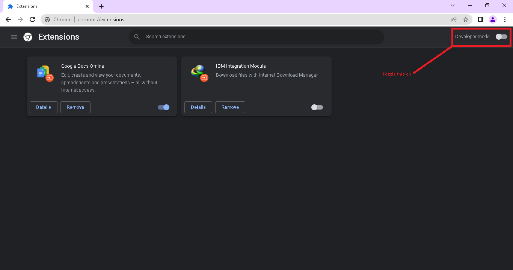

# Installation

Below are the steps to install the `Zipload Scrapper` extension :-

1.) Goto [chrome://extensions](chrome://extensions),

2.) Turn on developer mode

3.) Once developer mode is turned on click on the `Load unpacked` option.

4.) From the folder browser select the folder where you have cloned this repo,

Yay! You've just installed the extension. 🎉
